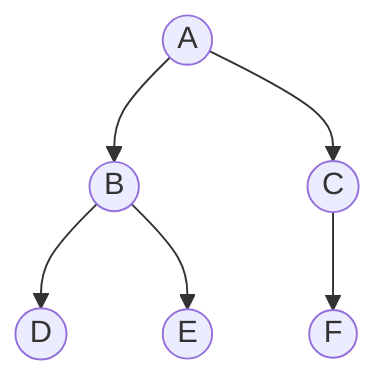

Here is a clear explanation of **Breadth-First Search (BFS)** and **Depth-First Search (DFS)**, including step-by-step visualizations and code implementations in both **JavaScript** and **Java**.

---

### The Sample Graph
To explain both algorithms, we will use the following directed graph starting from node **A**:



---

## 1. Breadth-First Search (BFS)
* **Strategy**: Explore the graph level-by-level. Visit all immediate neighbors of a node before moving deeper.
* **Key Data Structure**: **Queue** (First-In, First-Out / FIFO).
* **Use Case**: Finding the shortest path in an unweighted graph.

### Step-by-Step Execution:
1. Start at **A**. Mark it as visited and add it to the Queue. `Queue = [A]`
2. Dequeue **A**. Visit it. Add its unvisited neighbors (**B**, **C**) to the Queue. `Queue = [B, C]`
3. Dequeue **B**. Visit it. Add its unvisited neighbors (**D**, **E**) to the Queue. `Queue = [C, D, E]`
4. Dequeue **C**. Visit it. Add its unvisited neighbor (**F**) to the Queue. `Queue = [D, E, F]`
5. Dequeue **D**, **E**, and **F** one by one. Since they have no unvisited neighbors, the queue becomes empty.

* **BFS Traversal Order**: `A ➔ B ➔ C ➔ D ➔ E ➔ F`

---

## 2. Depth-First Search (DFS)
* **Strategy**: Explore as deep as possible along each branch before backtracking.
* **Key Data Structure**: **Stack** (Last-In, First-Out / LIFO) or **Recursion** (which uses the programming language's call stack).
* **Use Case**: Pathfinding, cycle detection, or topological sorting.

### Step-by-Step Execution (Recursive):
1. Start at **A**. Visit **A**.
2. Go to **A**'s first neighbor, **B**. Visit **B**.
3. Go to **B**'s first neighbor, **D**. Visit **D**.
4. **D** has no neighbors. Backtrack to **B**.
5. Go to **B**'s next neighbor, **E**. Visit **E**.
6. **E** has no neighbors. Backtrack to **B**, then backtrack to **A**.
7. Go to **A**'s next neighbor, **C**. Visit **C**.
8. Go to **C**'s neighbor, **F**. Visit **F**.

* **DFS Traversal Order**: `A ➔ B ➔ D ➔ E ➔ C ➔ F`

---

## Implementations in JavaScript

In JavaScript, we represent the graph using an **Adjacency List** (a standard JavaScript object mapping nodes to lists of their neighbors).

```javascript
// Graph representation
const graph = {
  'A': ['B', 'C'],
  'B': ['D', 'E'],
  'C': ['F'],
  'D': [],
  'E': [],
  'F': []
};

// 1. BFS Implementation
function bfs(graph, startNode) {
  const queue = [startNode];
  const visited = new Set([startNode]);
  const result = [];

  while (queue.length > 0) {
    const currentNode = queue.shift(); // Dequeue (FIFO)
    result.push(currentNode);

    for (const neighbor of graph[currentNode]) {
      if (!visited.has(neighbor)) {
        visited.add(neighbor);
        queue.push(neighbor); // Enqueue
      }
    }
  }
  return result;
}

// 2. DFS Implementation (Recursive)
function dfs(graph, startNode) {
  const visited = new Set();
  const result = [];

  function traverse(node) {
    if (!node || visited.has(node)) return;
    
    visited.add(node);
    result.push(node);

    for (const neighbor of graph[node]) {
      traverse(neighbor); // Recursive dive (LIFO call stack)
    }
  }

  traverse(startNode);
  return result;
}

// Execution
console.log("BFS Traversal:", bfs(graph, 'A').join(" -> ")); // A -> B -> C -> D -> E -> F
console.log("DFS Traversal:", dfs(graph, 'A').join(" -> ")); // A -> B -> D -> E -> C -> F
```

---

## Implementations in Java

In Java, we represent the graph using a `Map<Character, List<Character>>`.

```java
import java.util.*;

public class GraphTraversal {
    
    // 1. BFS Implementation
    public static List<Character> bfs(Map<Character, List<Character>> graph, char startNode) {
        List<Character> result = new ArrayList<>();
        Queue<Character> queue = new LinkedList<>();
        Set<Character> visited = new HashSet<>();

        queue.add(startNode);
        visited.add(startNode);

        while (!queue.isEmpty()) {
            char currentNode = queue.poll(); // Dequeue (FIFO)
            result.add(currentNode);

            for (char neighbor : graph.getOrDefault(currentNode, Collections.emptyList())) {
                if (!visited.contains(neighbor)) {
                    visited.add(neighbor);
                    queue.add(neighbor); // Enqueue
                }
            }
        }
        return result;
    }

    // 2. DFS Implementation (Recursive Helper)
    public static List<Character> dfs(Map<Character, List<Character>> graph, char startNode) {
        List<Character> result = new ArrayList<>();
        Set<Character> visited = new HashSet<>();
        dfsHelper(graph, startNode, visited, result);
        return result;
    }

    private static void dfsHelper(Map<Character, List<Character>> graph, char node, 
                                  Set<Character> visited, List<Character> result) {
        visited.add(node);
        result.add(node);

        for (char neighbor : graph.getOrDefault(node, Collections.emptyList())) {
            if (!visited.contains(neighbor)) {
                dfsHelper(graph, neighbor, visited, result); // Recursive Call
            }
        }
    }

    public static void main(String[] args) {
        // Build Graph Adjacency List
        Map<Character, List<Character>> graph = new HashMap<>();
        graph.put('A', Arrays.asList('B', 'C'));
        graph.put('B', Arrays.asList('D', 'E'));
        graph.put('C', Arrays.asList('F'));
        graph.put('D', new ArrayList<>());
        graph.put('E', new ArrayList<>());
        graph.put('F', new ArrayList<>());

        System.out.println("BFS Traversal: " + bfs(graph, 'A')); 
        // Output: [A, B, C, D, E, F]

        System.out.println("DFS Traversal: " + dfs(graph, 'A')); 
        // Output: [A, B, D, E, C, F]
    }
}
```

---

### Comparison Summary

| Feature | BFS (Breadth-First Search) | DFS (Depth-First Search) |
| :--- | :--- | :--- |
| **Data Structure** | Queue (FIFO) | Stack or Recursion (LIFO) |
| **Traversal Path** | Level-by-level | Branch-by-branch (deep dive) |
| **Memory Complexity** | High (stores all nodes at the current level) | Low (stores only the current branch path) |
| **Best For** | Shortest path on unweighted graphs | Finding a path, cycle detection |
